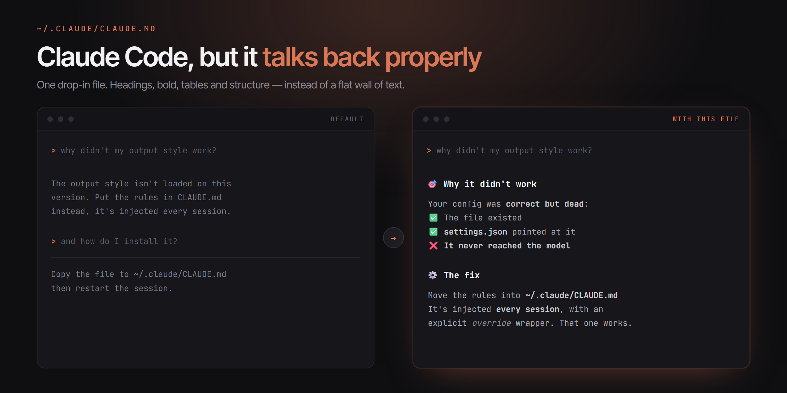

<div align="center">



<br><br>

# Claude Code — ChatGPT-style responses

**A single drop-in `CLAUDE.md` that makes Claude Code answer like ChatGPT.**<br>
Headings, bold, tables, emoji anchors — instead of a flat wall of plain text.

<br>

[](https://creativecommons.org/licenses/by/4.0/)
[](https://claude.com/claude-code)
[](#-install)
[](#-install)

</div>

<br>

---

## 🎯 Why

Claude Code answers in **terse, flat plain text** by default. That's the right call for a diff review. It's a cold read for everything else.

And a lot of us don't only use it to fix a build — we ask it real questions, we think out loud with it, we come back to it at 2am. A warmer, structured tone just makes that nicer.

This repo is that tone, in one file. **No dependency, no extension, nothing running in the background.** It's markdown.

---

## 🚀 Install

### ⚡ Fastest — one command

Writes the default style to `~/.claude/CLAUDE.md`, which applies to **all your projects**.

<details open>
<summary><b>🪟 Windows (PowerShell)</b></summary>

```powershell
curl.exe -o "$env:USERPROFILE\.claude\CLAUDE.md" https://raw.githubusercontent.com/veax-project/claude-code-chatgpt-style/main/CLAUDE.md
```
</details>

<details>
<summary><b>🍎 macOS / 🐧 Linux</b></summary>

```bash
curl -o ~/.claude/CLAUDE.md https://raw.githubusercontent.com/veax-project/claude-code-chatgpt-style/main/CLAUDE.md
```
</details>

> 💾 **This overwrites an existing `~/.claude/CLAUDE.md`.** If you already have one, use the script below instead — it backs yours up first.

### 🛡️ Safest — the install script

Backs up your current file, lets you **pick a variant**, and can **append** instead of replacing.

```bash
git clone https://github.com/veax-project/claude-code-chatgpt-style
cd claude-code-chatgpt-style
```

| Platform | Command |
|---|---|
| 🪟 Windows | `.\install.ps1` |
| 🪟 Windows, a variant | `.\install.ps1 -Variant concise` |
| 🪟 Windows, keep yours | `.\install.ps1 -Append` |
| 🍎🐧 macOS / Linux | `./install.sh` |
| 🍎🐧 A variant | `./install.sh concise` |
| 🍎🐧 Keep yours | `./install.sh default --append` |

### ✋ No terminal at all

Download [`CLAUDE.md`](CLAUDE.md), drop it in your `.claude` folder. Same result.

<br>

> ### ⚠️ Then restart
> `CLAUDE.md` is read **when a session starts**. Run `/clear` or open a new session — otherwise nothing changes. This is the #1 reason people think it did not work.

---

## 🎨 Variants

Same idea, different dosage. Pick one, install it as your `CLAUDE.md`.

| Variant | What it does | Good if |
|---|---|---|
| 📘 [**default**](CLAUDE.md) | Full treatment — headings, bold, tables, emoji anchors, elaborated answers | You want the ChatGPT feel |
| 🚫 [**no-emoji**](variants/no-emoji.md) | All the structure, **zero emojis** | Emojis annoy you or your team |
| ✂️ [**concise**](variants/concise.md) | Structured, but **short** — answer first, no padding | You like the layout, not the length |
| 💬 [**chat-only**](variants/chat-only.md) | Rich in conversation, **stripped down while coding** | You want warmth in chat, silence at work |
| 🇫🇷 [**français**](CLAUDE.fr.md) | The default, written in French, with French tone rules | You talk to it in French |
| 🇹🇷 [**türkçe**](CLAUDE.tr.md) | The default, written in Turkish, with Turkish tone rules | You talk to it in Turkish |
| 🇦🇿 [**azərbaycanca**](CLAUDE.az.md) | The default, written in Azerbaijani, with Azerbaijani tone rules | You talk to it in Azerbaijani |

<details>
<summary><b>📄 See exactly what you are installing</b></summary>

<br>

It is a plain instruction file — around 40 lines of markdown. **No code, no script, no network call, no telemetry.**

It tells the model to use headings, bold key terms, bullet lists, tables and emoji section anchors, to elaborate rather than answer dryly — and to keep two ChatGPT habits *out*: opening flattery and agreeing with everything.

Read the whole thing: [`CLAUDE.md`](CLAUDE.md)

</details>

---

## 🧯 Troubleshooting

| Symptom | Cause | Fix |
|---|---|---|
| 😐 Nothing changed | The session was already open | Run `/clear` or start a new session |
| 🤷 Still nothing | File is in the wrong place | It must be exactly `~/.claude/CLAUDE.md` |
| 🥱 It fades after a while | Long conversation, context got summarized | `/clear` and continue — the file reloads |
| 📉 Only some answers are styled | Working as intended | Structure kicks in on longer answers, not on one-liners |
| 💥 You lost your own CLAUDE.md | The one-liner overwrote it | The install script keeps a `.backup-<date>` copy — use it next time |

---

## ⚠️ Why not an output style?

Claude Code has (had) a feature literally built for this: **output styles** — a markdown file in `~/.claude/output-styles/`, plus `"outputStyle": "MyStyle"` in `settings.json`.

On **v2.1.179**, I set one up correctly and it **never reached the model** — the style content was nowhere in the system prompt. The `/output-style` command had already been removed from the CLI too.

So if you tried an output style and nothing happened: **you are not crazy, and it is not your file.**

`CLAUDE.md`, on the other hand, is injected into every session wrapped in an explicit *"these instructions override any default behavior"*. That is the one that works.

| Method | Scope | Status |
|---|---|---|
| `~/.claude/CLAUDE.md` | All projects | ✅ **Works** — injected every session |
| `./CLAUDE.md` | One project | ✅ **Works** — and wins over the global one |
| `~/.claude/output-styles/*.md` | All projects | ❌ Not applied on v2.1.179 |

*(An `output-styles/` copy ships here anyway, in case the feature comes back.)*

---

## 🔧 Tuning it

It is plain markdown — open it and edit. The obvious knobs:

| You want | Do this |
|---|---|
| 😵 Fewer emojis | Delete the `## Emojis` section, or take the [no-emoji](variants/no-emoji.md) variant |
| ✂️ Shorter answers | Swap *"Elaborate"* for *"Stay concise — structure, do not pad"* |
| 💬 Style only in chat | Take the [chat-only](variants/chat-only.md) variant |
| 🎩 More formal | Drop the warmth line, keep the structure rules |
| 🧩 Mix with your own rules | Install with `--append` — yours stay, this gets added below |

---

## 📌 What it deliberately leaves out

Two things that make ChatGPT tiring are **not** in here:

- ❌ **Opening flattery** — no *"Great question!"*
- ❌ **Agreeing with everything** — it still tells you when your idea is bad

Warm tone, not a yes-man.

---

## 📜 License

Licensed under **[CC BY 4.0](https://creativecommons.org/licenses/by/4.0/)**.

In plain English:

- ✅ Use it, copy it, modify it — commercially too
- ✅ Ship it in your own setup, your team, your company
- ⚠️ **If you republish or fork it, credit the original** and link back to this repo

The whole point of this file is to be copied. Just do not pass it off as your own. 🙂

<div align="center">
<br>
<sub>Built by <a href="https://github.com/veax-project">veax-project</a></sub>
</div>
